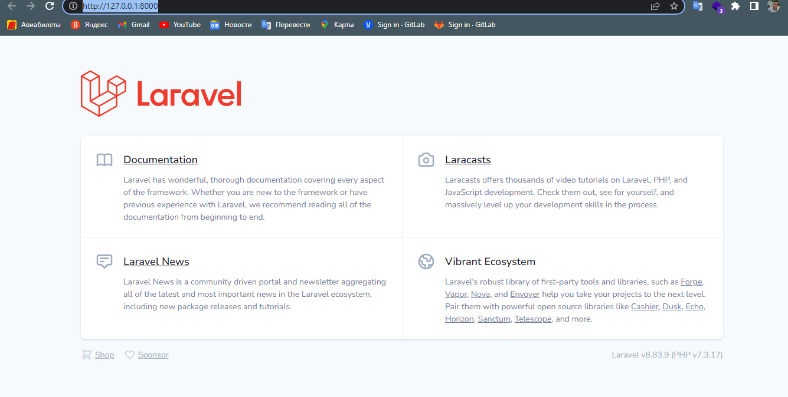
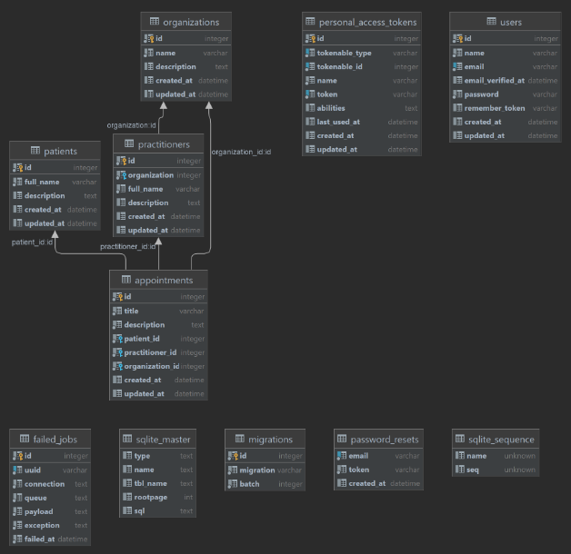
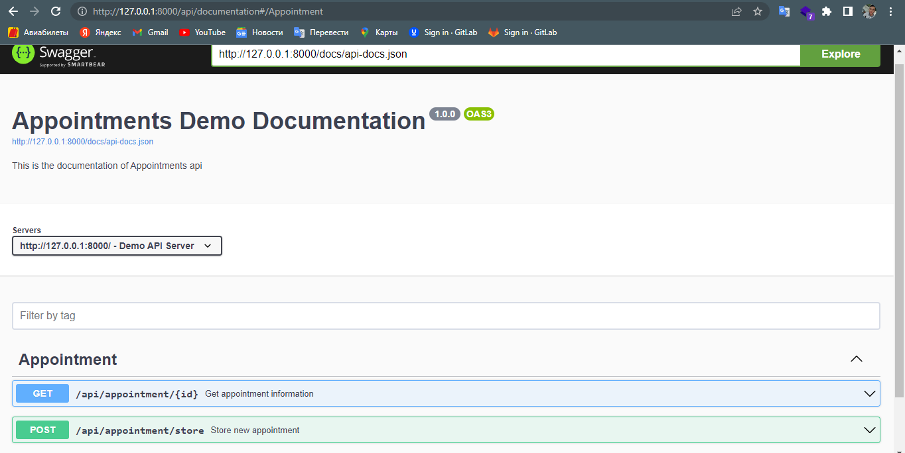

## Installing

`1. git clone https://github.com/Sardorbek1605/test-it-med.git`

`2. cd test-it-med`

`3. composer install`

`4. copy .env.example .env`
    
    After this you set your DB configs (password, username, db name) in .env file

`5. php artisan migrate`

`6. php artisan db:seed`

`7. php artisan key:generate`

`8. php artisan serve`

Run: <a href="http://127.0.0.1:8000/">http://127.0.0.1:8000

## The structure of database

## The main API
    
    http://127.0.0.1:8000/api/

## Swagger for view all API

    http://127.0.0.1:8000/api/documentation

## My note

    First of all, I had a hard time clearly understanding this assignment because it was in Russian.
    And the structure in the Appointment.schema.json file also seemed vague. That's why I developed APIs based on my own structured database!
    I mentioned the database above.

